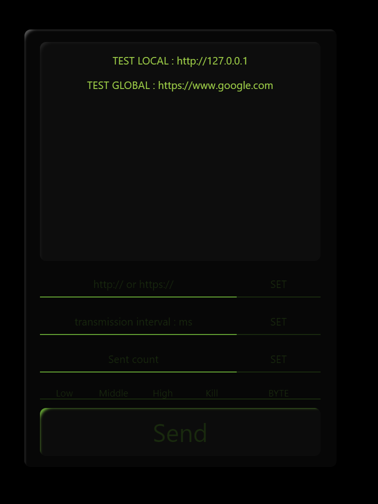

# LINK 
https://takenosite.github.io/Network-Stress-Test/

# Network-Stress-Test

DOS from javascript can be reproduced and threats can be verified.

# Generate Traffic     

## http:// or https://
http:// or https:// enter host after

Only port 443 is supported in this session

Access to boat 80 is blocked by browser-side security...

## Send Inteval
Specified in millisecond intervals.

## Send Count
Number of requests. 

# Data Generate
By specifying a byte, any data size can be generated.

